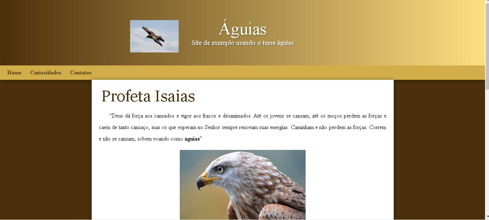

Olá! Neste arquivo, você encontrará um link para o projeto "Águia-01" hospedado no GitHub. Este projeto é sobre águias e pode conter informações interessantes sobre essas incríveis aves.

<h1># Sobre o Projeto</h1>

O projeto "Águia-01" é um site de exemplo utilizando html e css:</h1>

<a href="https://andrepimentaf.github.io/aguia-01/" target="_blank">[**Águia-01 GitHub**]</a>

<h2> Como Acessar o exemplo</h2>

1. Clique no link acima. Isso abrirá uma nova aba ou janela no seu navegador.

2. Você será direcionado para a página do projeto "Águia-01" no GitHub.

3. Explore o conteúdo do projeto para aprender mais sobre águias.

## :memo: Licença

Esse projeto está sob a licença MIT.

---

Feito by André Fonseca